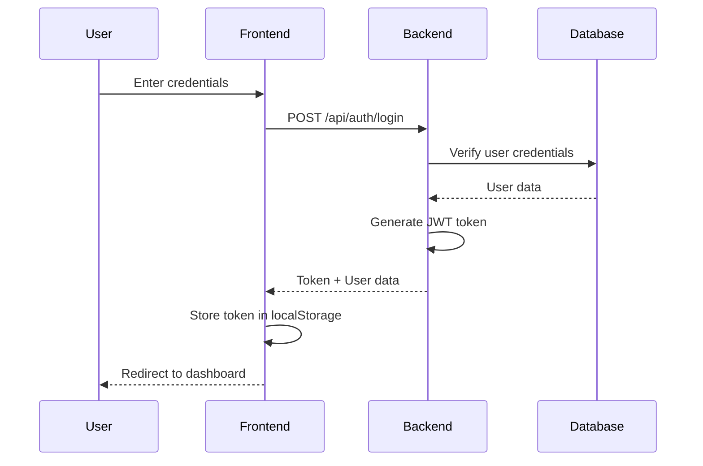
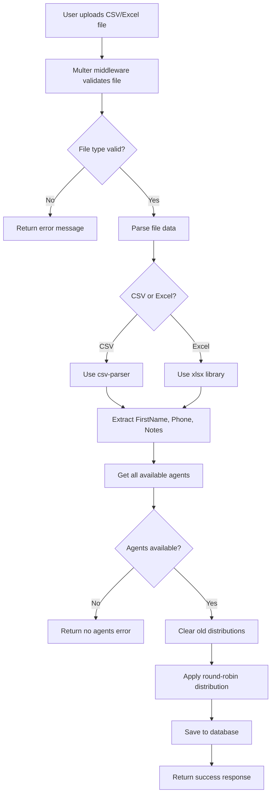

# 📋 Task Distribution Management System - Complete Documentation

## 🎯 Project Overview

Welcome to the **Task Distribution Management System** - a full-stack web application designed to streamline the process of managing agents and distributing tasks efficiently. This system allows administrators to create agent profiles, upload task files (CSV/Excel), and automatically distribute tasks among registered agents in a round-robin fashion.

### 🌟 Key Features
- **Secure Admin Authentication** with JWT tokens
- **Agent Management** - Add and view agents
- **File Upload & Processing** - Support for CSV and Excel files
- **Automatic Task Distribution** - Smart round-robin task assignment
- **Real-time Dashboard** - Modern, responsive UI with real-time updates
- **Data Visualization** - Clear task distribution views

---

## 🌐 Live Deployment

### 🚀 Application URLs
- **Frontend Application**: [https://csinfotechassignment.vercel.app/login](https://csinfotechassignment.vercel.app/login)
- **Backend API**: [https://csinfotechassignment.onrender.com](https://csinfotechassignment.onrender.com)

> **Note**: The backend may take a few moments to wake up on first request due to Render's free tier sleep mode.

## 🏗️ Architecture Overview

The application follows a **modern full-stack architecture** with clear separation of concerns:

```
┌─────────────────┐    HTTP/REST API    ┌─────────────────┐
│   React Frontend │ ◄─────────────────► │  Express Backend │
│   (Port 5173)    │                     │   (Port 3000)    │
└─────────────────┘                     └─────────────────┘
                                                   │
                                                   ▼
                                         ┌─────────────────┐
                                         │   MongoDB       │
                                         │   Database      │
                                         └─────────────────┘
```

---

## 📁 Project Structure Deep Dive

### 🖥️ Frontend (`/agent` folder)

The frontend is a **React 19** application built with **Vite** and styled with **Tailwind CSS**.

```
agent/
├── public/                     # Static assets
│   ├── background.jpg         # Dashboard background image
│   ├── welcome.jpg           # Welcome section image
│   └── vite.svg             # Vite logo
├── src/
│   ├── components/          # Reusable UI components
│   │   ├── AgentForm.jsx   # Form for adding new agents
│   │   ├── Dashboard.jsx   # Main dashboard layout
│   │   └── ProtectedRoute.jsx # Route protection wrapper
│   ├── compo/              # Feature-specific components
│   │   ├── AgentList.jsx   # Display list of agents
│   │   ├── CompactDistributionList.jsx # Task distribution view
│   │   ├── DistributionList.jsx # Detailed distribution view
│   │   ├── Loginform.jsx   # Login form component
│   │   └── UploadForm.jsx  # File upload interface
│   ├── context/
│   │   └── AuthContext.jsx # Global authentication state
│   ├── utils/
│   │   └── api.js          # API configuration and helpers
│   ├── assets/             # React-specific assets
│   ├── App.jsx             # Main application component
│   ├── main.jsx            # Application entry point
│   └── index.css           # Global styles with Tailwind
├── package.json            # Dependencies and scripts
├── vite.config.js          # Vite configuration
├── eslint.config.js        # Code linting rules
└── index.html              # HTML template
```

#### 🔧 Frontend Technology Stack
- **React 19.1.1** - Latest React with concurrent features
- **React Router DOM 7.9.1** - Client-side routing
- **Tailwind CSS 4.1.13** - Utility-first styling
- **React Toastify** - Beautiful notifications
- **Vite 7.1.7** - Fast build tool and dev server

### 🔧 Backend (`/backend` folder)

The backend is an **Express.js** server with **MongoDB** integration.

```
backend/
├── controllers/                 # Business logic handlers
│   ├── agentController.js      # Agent CRUD operations
│   ├── authController.js       # Authentication logic
│   └── distributionController.js # File processing & task distribution
├── middleware/
│   └── upload.js               # Multer file upload configuration
├── modals/                     # Database schemas (Note: should be "models")
│   ├── agent.js               # Agent schema definition
│   ├── distribuiton.js        # Distribution schema definition
│   └── user.js                # User schema definition
├── routes/                     # API route definitions
│   ├── agentroute.js          # Agent-related endpoints
│   ├── authroute.js           # Authentication endpoints
│   └── distributionRoute.js   # Distribution endpoints
├── uploads/                    # Temporary file storage
├── index.js                    # Server entry point
├── setup-admin.js             # Admin user creation script
└── package.json               # Dependencies and scripts
```

#### 🔧 Backend Technology Stack
- **Express.js 5.1.0** - Web application framework
- **MongoDB** with **Mongoose 8.18.1** - Database and ODM
- **JWT (jsonwebtoken 9.0.2)** - Secure authentication
- **bcryptjs 3.0.2** - Password hashing
- **Multer 2.0.2** - File upload handling
- **XLSX 0.18.5** - Excel file processing
- **CSV-Parser 3.2.0** - CSV file processing
- **CORS 2.8.5** - Cross-origin resource sharing

---

## 🔐 Authentication Flow

The application implements a **robust JWT-based authentication system**:

### 1. Login Process


### 2. Route Protection
- **ProtectedRoute Component**: Wraps dashboard to ensure authentication
- **AuthContext**: Global state management for user authentication
- **Token Persistence**: Stored in localStorage for session continuity
- **Automatic Logout**: Clears token and redirects to login

### 3. Security Features
- **Password Hashing**: bcryptjs with salt rounds
- **JWT Expiration**: 24-hour token validity
- **CORS Protection**: Configured for secure cross-origin requests
- **Input Validation**: Server-side validation for all inputs

---

## 🛣️ API Routes & Endpoints

### 🔑 Authentication Routes (`/api/auth`)

| Method | Endpoint | Description | Request Body | Response |
|--------|----------|-------------|--------------|----------|
| POST | `/api/auth/login` | User authentication | `{ email, password }` | `{ token, user: { id, name, email } }` |

**Example Request:**
```javascript
POST /api/auth/login
Content-Type: application/json

{
  "email": "admin@example.com",
  "password": "adminpassword"
}
```

**Example Response:**
```javascript
{
  "token": "eyJhbGciOiJIUzI1NiIsInR5cCI6IkpXVCJ9...",
  "user": {
    "id": "64f123456789abcdef123456",
    "name": "Admin User",
    "email": "admin@example.com"
  }
}
```

### 👥 Agent Management Routes (`/api/agents`)

| Method | Endpoint | Description | Request Body | Response |
|--------|----------|-------------|--------------|----------|
| POST | `/api/agents` | Create new agent | `{ name, email, mobile, password }` | `{ message, agent }` |
| GET | `/api/agents` | Get all agents | None | `[{ _id, name, email, mobile }]` |

**Example Create Agent Request:**
```javascript
POST /api/agents
Content-Type: application/json

{
  "name": "John Doe",
  "email": "john@example.com",
  "mobile": "+1234567890",
  "password": "securepassword"
}
```

### 📤 Distribution Routes (`/api/distributions`)

| Method | Endpoint | Description | Request Body | Response |
|--------|----------|-------------|--------------|----------|
| POST | `/api/distributions/upload` | Upload file and distribute tasks | FormData with file | `{ message, distributions }` |
| GET | `/api/distributions` | Get all distributions | None | `[{ agentId, tasks[] }]` |

**File Upload Requirements:**
- **Supported Formats**: `.csv`, `.xlsx`, `.xls`
- **Required Columns**: `FirstName`, `Phone`, `Notes`
- **File Size**: Handled by Multer middleware

---

## 📊 Database Schema

### 🧑‍💼 User Model
```javascript
{
  name: String (required),
  email: String (required, unique),
  password: String (required, hashed),
  role: String (default: "admin")
}
```

### 👤 Agent Model
```javascript
{
  name: String (required),
  email: String (required, unique),
  mobile: String (required),
  password: String (required, hashed)
}
```

### 📋 Distribution Model
```javascript
{
  agentId: ObjectId (ref: "Agent"),
  tasks: [{
    firstName: String,
    phone: String,
    notes: String
  }]
}
```

---

## 🔄 Data Flow & Business Logic

### 1. **File Upload & Processing Flow**



### 2. **Round-Robin Task Distribution Logic**

The system uses an intelligent round-robin algorithm to ensure fair task distribution:

```javascript
// Simplified distribution logic
items.forEach((item, index) => {
  const agentIndex = index % agents.length; // Round-robin assignment
  const agentId = agents[agentIndex]._id;
  
  // Find or create distribution for this agent
  let distribution = distributions.find(d => d.agentId.equals(agentId));
  if (!distribution) {
    distribution = { agentId, tasks: [] };
    distributions.push(distribution);
  }
  
  distribution.tasks.push(item);
});
```

**Example Distribution:**
- 10 tasks, 3 agents → Agent 1: 4 tasks, Agent 2: 3 tasks, Agent 3: 3 tasks

---

## 🎨 Frontend Components Deep Dive

### 🔐 **AuthContext.jsx** - Global Authentication State
- **Purpose**: Centralized authentication management
- **Features**:
  - Token persistence in localStorage
  - User state management
  - Login/logout functions
  - Authentication status checking

### 🛡️ **ProtectedRoute.jsx** - Route Protection
- **Purpose**: Ensures only authenticated users access protected pages
- **Logic**: Checks authentication status before rendering children

### 🏠 **Dashboard.jsx** - Main Application Interface
- **Features**:
  - Responsive layout with background overlay
  - Agent management section
  - Task distribution interface
  - Real-time updates with refresh mechanism
  - Beautiful gradient overlays and glassmorphism effects

### 📝 **AgentForm.jsx** - Agent Creation Interface
- **Functionality**:
  - Form validation
  - API integration for agent creation
  - Success/error handling with toast notifications

### 📊 **CompactDistributionList.jsx** - Task Overview
- **Purpose**: Display task distributions in a compact, readable format
- **Features**: Real-time updates when new files are uploaded

---

## 🚀 Getting Started Guide

### 📋 Prerequisites
- **Node.js** (v16 or higher)
- **MongoDB** (local or MongoDB Atlas)
- **npm** or **yarn** package manager

### 🔧 Installation Steps

#### 1. **Clone and Setup Backend**
```bash
cd backend
npm install
```

#### 2. **Environment Configuration**
Create `.env` file in backend directory:
```env
PORT=3000
MONGO_URL=mongodb://localhost:27017/task-distribution
JWT_SECRET=your-super-secure-jwt-secret-key-here
```

#### 3. **Database Setup**
```bash
# Start MongoDB service
mongod

# Create admin user (optional)
npm run setup-admin
```

#### 4. **Start Backend Server**
```bash
# Development mode with auto-restart
npm run dev

# Production mode
npm start
```

#### 5. **Setup Frontend**
```bash
cd ../agent
npm install
```

#### 6. **Configure Frontend Environment**
Create `.env` file in agent directory:
```env
VITE_API_URL=http://localhost:3000
```

#### 7. **Start Frontend Development Server**
```bash
npm run dev
```

### 🌐 **Access the Application**
- Frontend: `http://localhost:5173`
- Backend API: `http://localhost:3000`

---

## 📱 User Experience Flow

### 1. **Admin Login**
- Clean, centered login form
- Real-time validation
- Loading states with spinner
- Error handling with toast notifications

### 2. **Dashboard Experience**
- **Welcome Section**: Beautiful hero area with security features highlight
- **Agent Management**: Side-by-side layout for form and list
- **Task Distribution**: Upload and view distributions simultaneously
- **Responsive Design**: Works seamlessly on all device sizes

### 3. **File Upload Process**
- Drag-and-drop interface (if implemented)
- File type validation
- Progress indicators
- Immediate feedback on successful distribution

### 4. **Real-time Updates**
- Automatic refresh of distribution lists
- Toast notifications for all actions
- Smooth transitions and animations

---

## 🔧 Technical Implementation Details

### **State Management Strategy**
- **React Context** for global authentication state
- **Local State** for component-specific data
- **Prop Drilling** minimized through context usage

### **API Communication**
- **Centralized API Configuration** in `utils/api.js`
- **Error Handling** with try-catch blocks
- **Loading States** for better UX
- **Toast Notifications** for user feedback

### **File Processing Architecture**
- **Multer Middleware** for secure file handling
- **Stream Processing** for large CSV files
- **Memory Efficient** Excel parsing
- **Automatic Cleanup** of uploaded files

### **Security Implementations**
- **Password Hashing** with bcryptjs
- **JWT Token Validation** on protected routes
- **File Type Validation** on upload
- **CORS Configuration** for cross-origin security

---

## 🐛 Error Handling & Validation

### **Frontend Error Handling**
- **Form Validation**: Real-time validation for login and agent forms
- **Network Errors**: Graceful handling of API failures
- **File Validation**: Client-side file type checking
- **Toast Notifications**: User-friendly error messages

### **Backend Error Handling**
- **Mongoose Validation**: Schema-level data validation
- **Try-Catch Blocks**: Comprehensive error catching
- **Custom Error Messages**: Meaningful error responses
- **File Upload Errors**: Multer error handling

### **Common Error Scenarios**
1. **Invalid Login Credentials**: Clear feedback without revealing system details
2. **Duplicate Agent Email**: Prevents duplicate entries
3. **Invalid File Format**: Only allows CSV/Excel files
4. **No Agents Available**: Prevents distribution without agents
5. **Database Connection Issues**: Graceful server error handling

---

## 🎯 Key Features Explained

### **1. Intelligent Task Distribution**
The round-robin algorithm ensures fair distribution:
- Tasks are assigned sequentially to agents
- Equal distribution when possible
- Handles any number of agents and tasks
- Automatic balancing

### **2. File Processing Capabilities**
- **CSV Support**: Streaming parser for large files
- **Excel Support**: Full .xlsx and .xls compatibility
- **Data Validation**: Ensures required columns exist
- **Error Recovery**: Graceful handling of malformed data

### **3. Responsive Design**
- **Mobile-First**: Designed for all screen sizes
- **Glassmorphism**: Modern UI with backdrop blur effects
- **Tailwind CSS**: Utility-first styling approach
- **Custom Animations**: Smooth transitions and loading states

### **4. Real-time Updates**
- **Refresh Mechanism**: Manual refresh triggers
- **State Synchronization**: Keeps UI in sync with backend
- **Live Feedback**: Immediate response to user actions

---

## 🔮 Future Enhancement Opportunities

### **Immediate Improvements**
1. **Real-time Notifications**: WebSocket integration
2. **Bulk Agent Import**: CSV upload for multiple agents
3. **Task Status Tracking**: Mark tasks as completed
4. **Advanced Filtering**: Search and filter capabilities

### **Advanced Features**
1. **Role-Based Access Control**: Multiple user roles
2. **Analytics Dashboard**: Task completion statistics
3. **Email Notifications**: Automated agent notifications
4. **API Rate Limiting**: Enhanced security measures

### **Scalability Enhancements**
1. **Database Indexing**: Optimized query performance
2. **Caching Layer**: Redis integration
3. **File Storage**: Cloud storage integration
4. **Microservices**: Service decomposition

---

## 🛡️ Security Best Practices Implemented

### **Authentication Security**
- **JWT Tokens**: Secure, stateless authentication
- **Password Hashing**: bcryptjs with salt rounds
- **Token Expiration**: 24-hour validity period
- **Secure Storage**: localStorage for token persistence

### **Input Validation**
- **Server-side Validation**: All inputs validated on backend
- **File Type Restriction**: Only specific formats allowed
- **Email Uniqueness**: Prevents duplicate registrations
- **SQL Injection Prevention**: Mongoose ODM protection

### **Network Security**
- **CORS Configuration**: Controlled cross-origin access
- **HTTPS Ready**: Production-ready security headers
- **Environment Variables**: Sensitive data protection
- **Error Message Sanitization**: No system information leakage

---

## 📈 Performance Considerations

### **Frontend Optimization**
- **Vite Build Tool**: Fast development and building
- **Code Splitting**: Route-based splitting ready
- **Asset Optimization**: Compressed images and assets
- **Lazy Loading**: Components loaded on demand

### **Backend Optimization**
- **Stream Processing**: Memory-efficient file parsing
- **Database Indexing**: Optimized queries (recommended)
- **File Cleanup**: Automatic temporary file removal
- **Connection Pooling**: MongoDB connection optimization

### **Scalability Features**
- **Stateless Design**: Horizontal scaling ready
- **Modular Architecture**: Easy feature addition
- **API Design**: RESTful and consistent
- **Error Boundaries**: Fault-tolerant frontend

---

## 🎓 Learning Outcomes & Technical Skills

This project demonstrates proficiency in:

### **Frontend Development**
- **Modern React Patterns**: Hooks, Context, Functional components
- **State Management**: Global and local state handling
- **Responsive Design**: Mobile-first CSS approach
- **User Experience**: Loading states, error handling, notifications

### **Backend Development**
- **RESTful API Design**: Clear, consistent endpoints
- **Database Modeling**: Relational data with MongoDB
- **File Processing**: Multiple format support
- **Security Implementation**: Authentication and validation

### **Full-Stack Integration**
- **API Communication**: Frontend-backend integration
- **Authentication Flow**: End-to-end security
- **Error Handling**: Comprehensive error management
- **Development Workflow**: Modern tooling and practices

---

## 📞 Troubleshooting Guide

### **Common Issues & Solutions**

#### **Backend Won't Start**
```bash
# Check MongoDB connection
mongod --version

# Verify environment variables
cat .env

# Check port availability
lsof -i :3000
```

#### **Frontend API Errors**
```bash
# Verify backend is running
curl http://localhost:3000

# Check environment variables
cat .env
```

#### **File Upload Issues**
- Ensure `uploads/` directory exists
- Check file format (CSV, Excel only)
- Verify column names match requirements

#### **Authentication Problems**
- Clear localStorage in browser
- Check JWT secret configuration
- Verify user exists in database

---

## 🏆 Conclusion

The **Task Distribution Management System** represents a comprehensive full-stack application that combines modern web technologies with practical business solutions. The system successfully demonstrates:

- **Clean Architecture**: Separation of concerns and modular design
- **Modern Technologies**: Latest React, Express, and MongoDB features
- **Security Focus**: JWT authentication and input validation
- **User Experience**: Responsive design and real-time feedback
- **Scalability**: Foundation for future enhancements

This documentation serves as both a technical reference and a showcase of the thoughtful engineering decisions that went into creating a production-ready task management solution.

---

## 📋 Quick Reference

### **Default Credentials**
```
Email: admin@example.com
Password: admin123
```

### **API Base URL**
```
Development: http://localhost:3000
```

### **File Upload Requirements**
```
Formats: .csv, .xlsx, .xls
Columns: FirstName, Phone, Notes
```

### **Tech Stack Summary**
```
Frontend: React 19 + Vite + Tailwind CSS
Backend: Express.js + MongoDB + JWT
Tools: Multer, XLSX, CSV-Parser, bcryptjs
```

---
Thankyou ❤️
